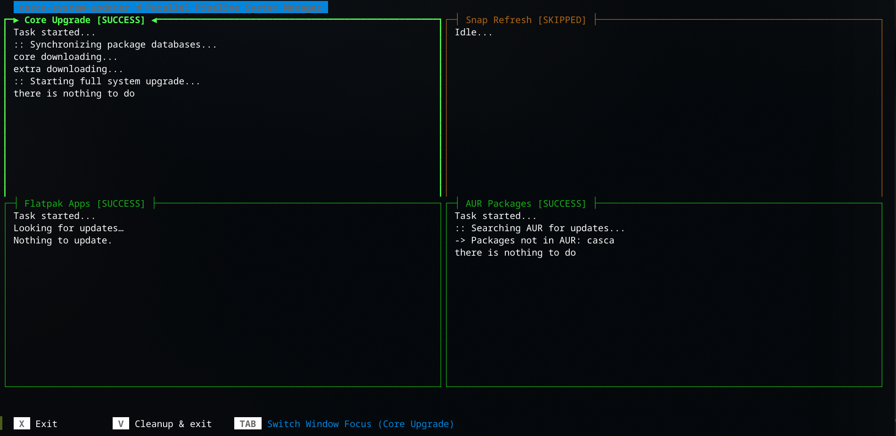

**⚔️ Casca: Linux System Upgrade TUI tool**

Casca is an intelligent, multi-threaded, cross-distribution maintenance tool designed to sync, upgrade, and clean your Linux system through a single execution window. Heavily inspired by the structural aesthetics of btop, Casca replaces standard sequential terminal logs with a responsive, concurrent 4-quadrant curses TUI dashboard that monitors and streams multiple package management pipelines simultaneously.

🚀 Features
🔍 Smart Architecture Detection: Autodetects Arch Linux, Fedora/Nobara, and Debian/Ubuntu systems on the fly.

⚡ Concurrent Execution Matrix: Runs core system upgrades, AUR updates for Arch Linux, Flatpak refreshes, and Snap syncs in parallel threads instead of making you wait for them sequentially.

📊 Live-Streamed Curses TUI Layout: Features automatic ANSI color striping, live terminal log viewing, auto-scrolling buffers, and dynamic TAB focus shifting between update quadrants.

⚔️ Deep Log Fail-Safe Scanning: Implements multi-layered health validation, continuously scanning text outputs for hidden dependency conflicts or network blockages to ensure exact SUCCESS or FAILED status flags.

🧹 Interactive Debris Purging: Offers a "nano-style" hotkey layout at the end of the run to seamlessly purge orphan packages and clean cache directories across your specific distribution.
